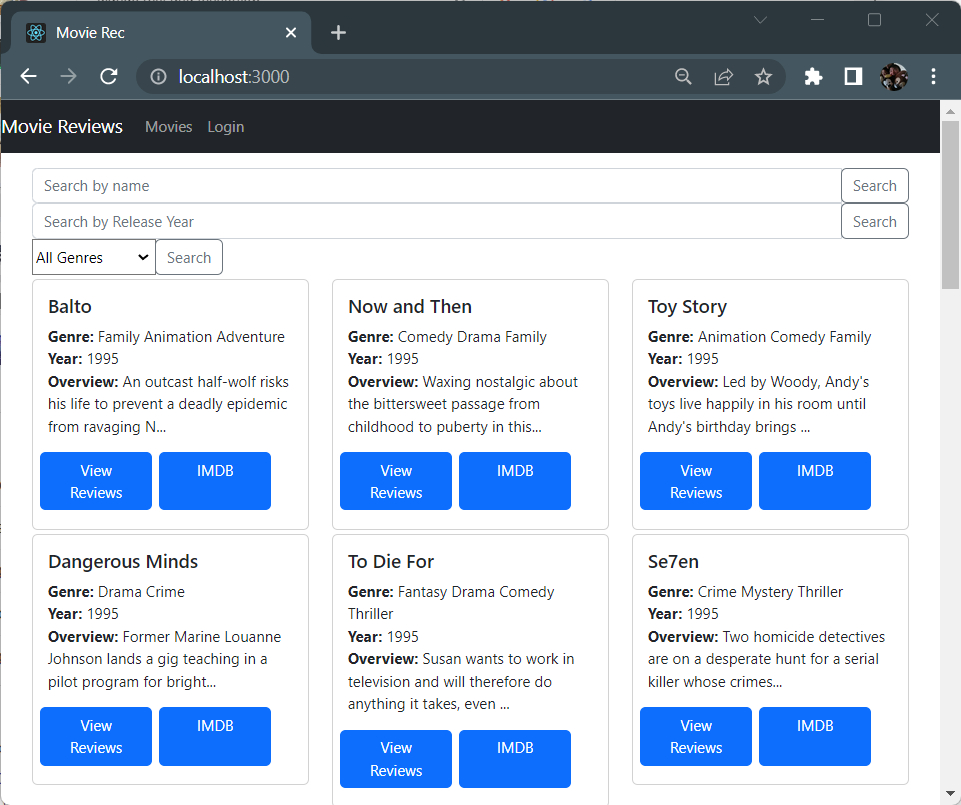
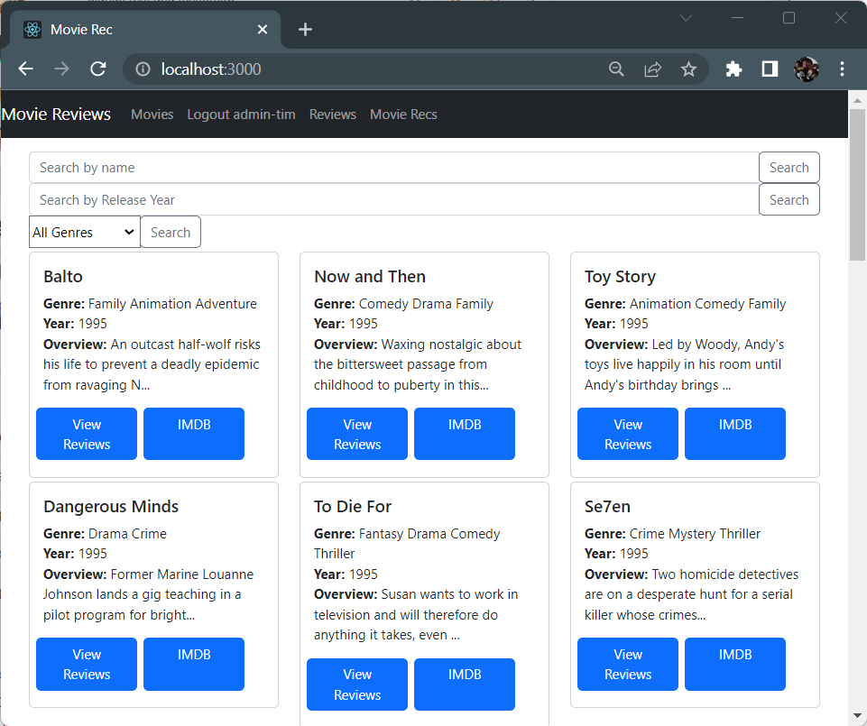
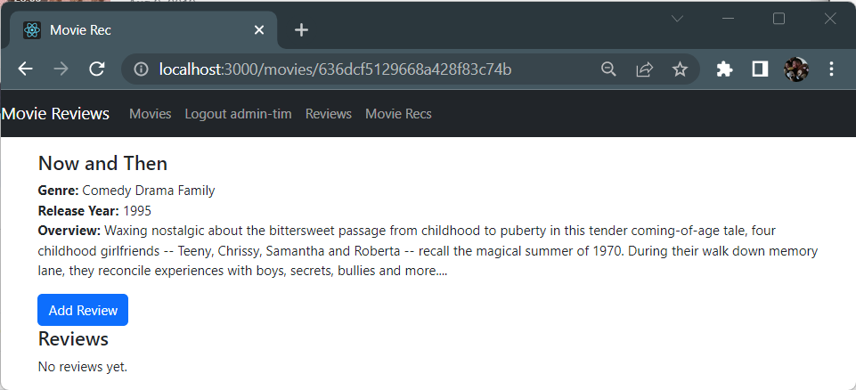
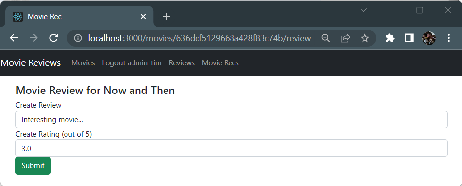
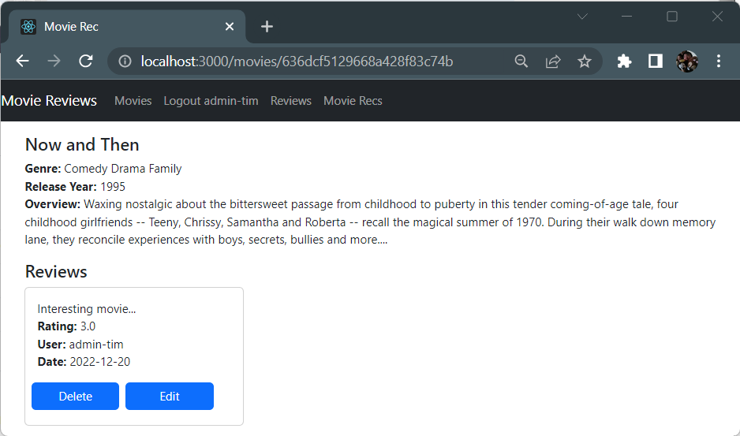
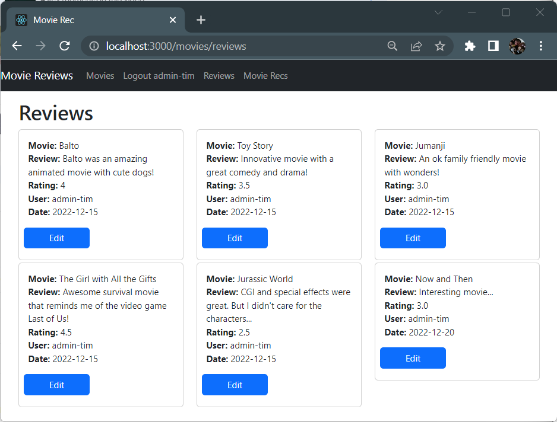

# MERN-Movie-Reviewer
Full stack web app using the MERN stack (MongoDB, Express, React, and Node.js) to CRUD (Create, Read, Update and Delete) movie reviews and ratings.

MERN:
<ul>
	<li>MongoDB: Document based open source database</li>
	<li>Express: Web application framework that makes it simpler to code a web server in JavaScript.</li>
	<li>React: Front-end library for building user interfaces.</li>
	<li>Nodes.js: Allows Javascript to run outside a browser in places like a web server.</li>
</ul>

Backend Dependencies:
<ul>
	<li><code>express</code></li>
	<li><code>cors</code>: Cross-origin resource sharing, allows ajax request to skip the same origin policy and access resources from remote hosts. The cors package provides an express middleware than can enable cors with different options. Basically going it make it so we can make the right connections on our network that we need to make.</li>
	<li><code>mongodb</code>: </li>
	<li><code>dotenv</code>: Loads environmental variables from a dot emv file in the process. Environmental variables can be stored in a file.</li>
	<li><code>nodemon</code>: Nodemon helps develop node.js based applications by automatically restarting the node application.</li>
</ul>

Frontend Dependencies:
<ul>
	<li><code>bootstrap</code></li>
	<li><code>react-router-dom@5</code>: To route different urls to different pages on our site.</li>
	<li><code>axios</code>: Axios for the get/post/put/delete requests.</li>
</ul>

To use:
<ul>
	<li>Open 2 command prompts.</li>
	<li>Navigate to "backend" folder and run ~<code>nodemon start</code> to start the backend.</li>
	<li>Navigate to "frontend" folder and run ~<code>npm start</code> to start the front end.</li>
	<li>Your browser will open up to your localhost and you will be brought to the homepage.</li>
</ul>

<h3>Search for movies using the Search by Name, Search by Release Year or Genre queries. </h3>

<h3>After logging in, the Home page is updated with more tab option.</h3>

<h3>Clicking "View Reviews" on a movie gives you the option to add a review/rating for the movie.</h3>

<h3>Add your review.</h3>

<h3>Movie now displays your review.</h3>

<h3>Review tab displays all your reviews which you can edit.</h3>

